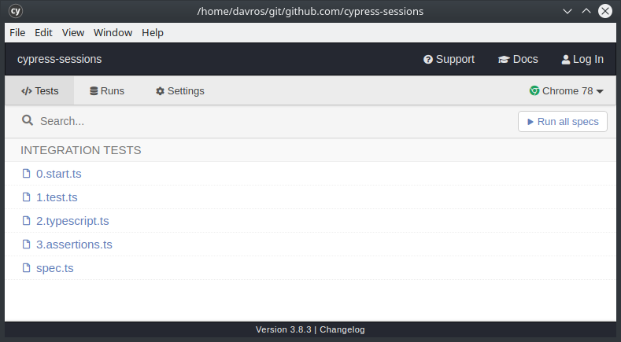
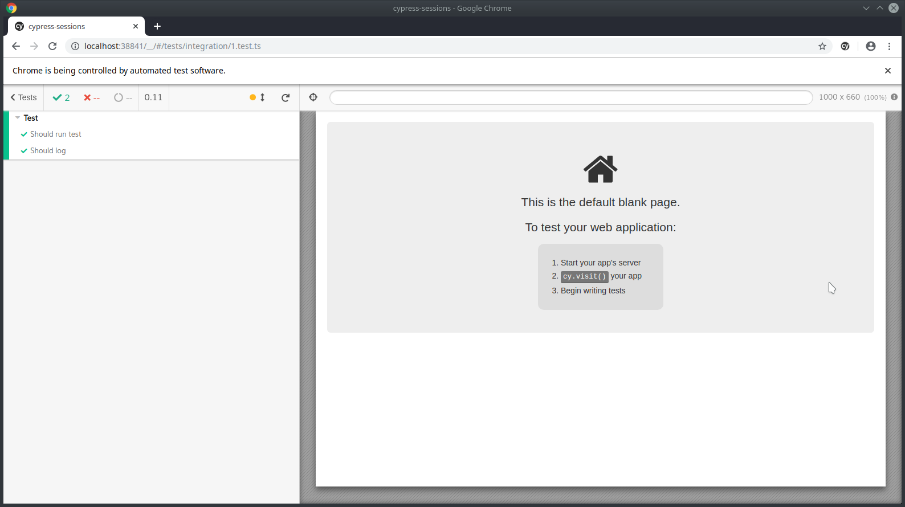

# Cypress sessions

This repository introduces the basics of Javascript and Typescript for having a good and comfortable start with Cypress.js

## Build with

- [Node.js](https://nodejs.org/en/)
- [Typescript](https://www.typescriptlang.org/)
- [Cypress.js](https://www.cypress.io/)

## Prerequisities

In order to ticker with this repository there is few things we have to install:

1. [node.js & npm](https://nodejs.org/en/) to run the project
2. [Google Chrome](https://www.google.com/chrome/) to run cypress.js
3. [git](https://www.google.com/chrome/) to clone this repository
4. [Visual Studio Code](https://code.visualstudio.com/) to manage this project is **optional**

# Starting with the project

1. Open terminal and clone this repository via `git clone <this_repository_url>`
2. Open Visual studio code and open folder - `File > Open Folder ...`

## Folder structure

- `cypress` - [cypress application folder](https://docs.cypress.io/guides/core-concepts/writing-and-organizing-tests.html) with tests, fixtures and other plugins 
- `node_modules` - libraries installed via npm
- `package.json` - library versions, scripts and others

## Tooling

### Command line interface

Command line interface also known as terminal, console or shell is a simple program or interpreter to execute commands in form of text.

#### Example of commands:
- `cd` - change directory
  - `cd /folder/subfolder` - absolute folder
  - `cd folder` or `cd ./folder` - relative folder
  - `cd ../../` - navigate back to folder
- `ls` - list
  - `ls` - list current folder
  - `ls -la` - list current folder with permission and size overview
  - `ls folder/subfolder` - list folder
- `git` - git version control
- `npm` - node package manager
  - `npm install` - install packages
  - `npm run <script>` - runs script defined in scripts

#### Useful shortcuts:
- `CTRL+C` - kill running command
- `CTRL+D` - end input

### git

[Git](https://git-scm.com/) is a version control system for managing code base and code increments within repository.

Commands:
- `git clone` - create a clone of repository
- others to come

### developer tools

- HTML tags with classes, ids, data attributes and other
  - tag - `div`, `a`, `span`, `footer`, `section` ...
  - classes - `class="first-class seconds-class"`
  - id's - `id="custom-id"`
  - data attributes - `data-cy="myElement"` `data-<something>="value"`

## Running the project

In order to start we need to install dependencies for the project, including cypress.js, create initial build and then simply open the cypress window for running tests.

In console run:

- `npm install`
- `npm run build`
- `npm run cypress:open`

# Introduction to cypress

> integration/0.start.ts

By running `cypress:open` you will simply open the cypress window. Withing listing you can simply select the first test to start with.

Now let's look around at what we can do.

## Basic test

> integration/1.test.ts

## Typescript intro

> integration/2.typescript.ts

## Assertion

https://docs.cypress.io/guides/references/assertions.html

> integration/3.assertions.ts

## Commands

https://docs.cypress.io/api/api/table-of-contents.html

> integration/commands

To look at:
- https://docs.cypress.io/api/commands/check.html
- https://docs.cypress.io/api/commands/contains.html
- https://docs.cypress.io/api/commands/trigger.html
- https://docs.cypress.io/api/commands/type.html
- https://docs.cypress.io/api/commands/scrollintoview.html